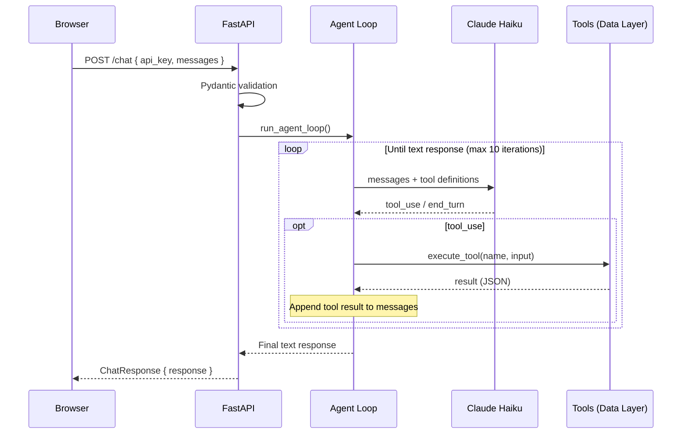

# Gene Cancer Agent

A natural-language chat interface that lets non-technical stakeholders query gene expression data across cancer types. Built as a proof of concept for the Owkin technical assessment.

**Live demo:** [owkin.jacobespersen.com](https://owkin.jacobespersen.com) (deployed on a Kubernetes cluster running on my homelab)

The core implementation was comfortably completed within the 4-hour time constraint. I spent some additional time setting up a proper CI/CD pipeline and deploying to my homelab Kubernetes cluster — not required, but it felt like a good opportunity to show how I'd ship something end-to-end.

## Quick Start

**Requirements:** Docker and an Anthropic API key.

```bash
# Start the app (available at http://localhost:8000)
docker compose up

# Run the full test suite
docker compose --profile test run --rm test
```

Enter your Anthropic API key in the top-right corner of the web interface to start chatting.

## Project Structure

```
├── app/
│   ├── main.py                  # FastAPI app, mounts static files, serves index.html
│   ├── routes/
│   │   └── chat.py              # /chat endpoint, delegates to agent service
│   ├── schemas/
│   │   └── chat.py              # Pydantic request/response models
│   ├── services/
│   │   ├── agent.py             # Agent loop: Claude ↔ tool execution
│   │   ├── data_loader.py       # CSV data access (get_targets, get_expressions)
│   │   └── tools.py             # Tool definitions, dispatcher, system prompt
│   ├── static/
│   │   ├── css/style.css
│   │   └── js/chat.js
│   └── templates/
│       └── index.html
├── tests/                       # Mirrors app/ structure
├── data/
│   └── owkin_take_home_data.csv
├── k8s/                         # Kustomize manifests (base + production overlay)
├── .github/workflows/ci.yml     # CI/CD pipeline
├── Dockerfile
├── Dockerfile.test
├── docker-compose.yml
└── pyproject.toml
```

## Architecture & Approach

### Agentic Loop

The core of the app is a hand-rolled agent loop rather than a framework like LangChain. The loop is simple: send the conversation + tool definitions to Claude (Haiku), execute any tool calls locally, append results, and repeat until Claude returns a text response.

This approach was chosen for **simplicity and control** — the entire loop is ~90 lines in `app/services/agent.py`, easy to debug, and gives full visibility into each iteration. There's no framework overhead, no magic, and no abstraction layers to dig through when something goes wrong.

**When would LangChain make sense?** When the agent needs to orchestrate many tools, chain multiple models, integrate with vector stores or retrieval pipelines, or when you need out-of-the-box support for streaming, memory, and complex routing. For two tools and a single model, a framework would add complexity without benefit.

### Request Flow



The backend is fully stateless — the full conversation history is sent with every request, and conversation state lives entirely in the browser.

### Tool Design

Two tools are exposed to Claude via the Anthropic tool-use schema, matching the functions provided in the assignment:

- **`get_targets(cancer_name)`** — returns genes associated with a cancer type
- **`get_expressions(cancer_name, genes)`** — returns median expression values for genes within a specific cancer type

The original `get_expressions` function from the assignment did not filter by cancer type, which meant it would return incorrect median values for genes that appear across multiple cancer indications. I updated it to accept a `cancer_name` parameter so values are always scoped to the correct cancer context.

**Note on spec deviation:** The assignment PDF defines `get_expressions(genes: List[str]) -> Dict[str, float]` with no `cancer_name` parameter. I deliberately deviated from this signature because the original implementation silently overwrites duplicate gene keys via `dict(zip(...))` — e.g. TP53 appears in 8 cancer indications, so calling `get_expressions(["TP53"])` would return only one of those values non-deterministically. A stricter reading of the spec would keep the original signature and disambiguate at the agent layer, or expose both versions behind a flag. I made a judgement call to fix the bug at the data-layer boundary; in a real engagement I'd flag this back to the spec author before changing the API.
Tools are restricted to an explicit allowlist, and unknown tool names raise a `ValueError`. Expected tool execution errors are caught and returned to Claude as error results so it can recover gracefully.

### Safety & Validation

- **`MAX_ITERATIONS = 10`** — prevents runaway agent loops
- **`SecretStr`** — API keys are never logged or serialized in plain text
- **Pydantic validation** — all requests are validated with explicit schemas; the API key format is checked before hitting the Anthropic API
- **Tool allowlist** — only declared tools can be executed
- **XSS protection** — LLM markdown output is rendered with marked.js and sanitized through DOMPurify

### AI Component Tradeoffs

- **Claude Haiku** was chosen for speed and cost — it's fast enough for a responsive PoC and handles tool orchestration over a small dataset well. For more complex queries or multi-step reasoning, a larger model (Sonnet or Opus) would produce better results at higher latency and cost
- **Non-deterministic outputs** — LLM responses vary between runs, which means identical questions may produce slightly different answers. Acceptable for a conversational interface, but something to account for if consistency matters
- **External API dependency** — the app requires an Anthropic API call for every interaction, so it can't run fully offline and is subject to API latency, rate limits, and availability
- **Cost per query** — each conversation turn costs tokens. For a PoC this is negligible, but at scale the cost of multi-turn agentic conversations (especially with tool loops) adds up and needs monitoring

### Dataset Coverage vs. Spec Questions

The assignment lists "What is the median value expression of genes involved in **esophageal cancer**?" as one of the example queries, but the supplied CSV contains no esophageal entries. The 10 cancer types actually present are: breast, colorectal, gastric, glioblastoma, lung, melanoma, ovarian, pancreatic, prostate, and renal. The agent will correctly respond that no data is available for esophageal cancer when asked. I substituted `glioblastoma` for the corresponding suggestion chip in the welcome screen so the example queries are all answerable from the dataset as shipped.

### Data Layer

The CSV is loaded once at module import time into a pandas DataFrame (`_df` in `data_loader.py`). This keeps the PoC simple, but for a production app the data should be lazy-loaded or served from a proper data store to avoid holding it in memory for the entire application lifetime.

### Test-Driven Development

This project was built using TDD. Tests are written before implementation, and the test suite mirrors the source structure under `tests/`. This approach catches design issues early and ensures every component is testable from the start.

## CI/CD & Testing

**Test coverage: 98%** across 33 tests.

The CI pipeline runs on every push and PR to `main`:

| Step | Tool | Purpose |
|------|------|---------|
| Lint + format | ruff | Code style and import ordering |
| Type checking | mypy | Static type analysis |
| Security scan | bandit | Catches common security issues |
| Dependency audit | pip-audit | Flags known vulnerabilities in dependencies |
| Tests | pytest | 90% coverage gate enforced |

On push to `main`, after all jobs pass, the pipeline builds the Docker image and pushes it to GHCR (`ghcr.io/jacobespersen/owkin-agent`) with `latest` and timestamped tags. ArgoCD watches the registry and automatically deploys the latest image to the homelab cluster.

## Frontend

The chat interface is styled to resemble Owkin's design language so the app feels familiar to reviewers. It's a single-page vanilla HTML/JS/CSS app with no build step.

- **Markdown rendering** — agent responses are rendered as formatted markdown via marked.js, sanitized with DOMPurify to prevent XSS from LLM output
- **Feedback buttons** — thumbs up/down on each response. These are cosmetic in the PoC, but they're designed with intent: in production, this feedback would feed into a tool like Langfuse to monitor chat trace quality and evaluate system prompt effectiveness
- **Suggestion chips** — the example queries from the assignment are available as one-click prompts

## Logging

The agent loop has detailed structured logging at every step: iteration count, tool calls with inputs, tool results, Claude's stop reason, token usage, and errors with full tracebacks. This gives complete visibility into what the agent does on every request — essential for debugging multi-step tool interactions.

## AI-Assisted Coding

This project was built using **Claude Code** with the **Superpowers** framework. Superpowers enforces a disciplined workflow: brainstorm the design, write a detailed implementation plan, then execute — which is crucial when working with AI. Without a solid plan, AI-assisted coding tends to drift. Superpowers is the best framework I've found for this kind of scoped project. I have also had great success with GSD(Get Shit Done), I find better for larger projects though

### Pros

- **Massive velocity boost** — built a full-stack app with CI/CD, 98% test coverage, Docker, and Kubernetes deployment within the time constraint
- **Strong at scaffolding** — boilerplate, test structure, configuration files, and CI pipelines come together fast
- **Comprehensive test generation** — excellent at writing tests that cover edge cases you might not think of, contributing to the 98% coverage
- **Useful for exploring unfamiliar APIs** — e.g. getting the Anthropic tool-use schema right without trial-and-error

### Cons

- **Requires strong technical judgment** — AI generates plausible but sometimes subtly wrong code. The original `get_expressions` bug (returning values across all cancer types instead of filtering) is a good example: the code looked correct but produced wrong results
- **Less line-level familiarity** — when you haven't written every single line yourself, you're not as deeply familiar with your code as in the past. But the benefits far outweigh this downside: it allows engineers to think about engineering and system design at a higher abstraction level
- **Thorough review is still essential** — AI-generated code needs the same rigorous review as any other code; trusting output without careful inspection leads to subtle bugs shipping to production
- **Can over-engineer if unchecked** — without clear scope, AI will happily add features you didn't ask for
- **Planning is non-negotiable** — AI-assisted coding without a clear implementation plan leads to drift and rework. The plan is the product; the code is the output

## What I'd Improve

This is a proof of concept — the purpose is to showcase functionality, not polish. Below is what I'd prioritise when moving toward production.

### Streaming (Priority #1)

The agent loop makes multiple round-trips to Claude (tool calls, execution, follow-up), so response times can easily reach 5–15 seconds. Without streaming, users have no feedback during that wait and will assume the app is broken. For non-technical stakeholders — the target audience — this silence erodes trust. Streaming is the single highest-impact improvement because it directly addresses perceived responsiveness, which determines whether users actually adopt the tool.

### UX

- Model selector to let users choose between Claude models
- Visualization and graphs for expression data comparisons
- Markdown formatting improvements in chat

### Observability & Monitoring

For the app to move from PoC to production-ready, it needs a full observability stack:

- **LLM monitoring** — Langfuse for tracing agent interactions, evaluating system prompt quality, and connecting the thumbs up/down feedback to actual performance metrics
- **Error tracking** — Sentry for capturing unhandled exceptions with full stack traces and request context. Pair with [oopsie](https://github.com/jacobespersen/oopsie), my project for automating fixes of uncaught errors
- **APM / Distributed tracing** — Datadog or OpenTelemetry to trace requests end-to-end across the API, Claude calls, and tool executions
- **Metrics** — Prometheus for request rates, latency histograms, error rates, and custom app metrics
- **Log aggregation** — Datadog or Grafana Loki to centralize and search structured logs across instances
- **Dashboards & alerting** — Grafana for visualizing metrics and triggering alerts on anomalies
- **Uptime & incident management** — PagerDuty for detecting outages and routing alerts
- **Request logging middleware** — structured HTTP request/response logging for debugging and audit

### Data & State

- Add a database to store users, chat threads, and conversation history — the current design is fully stateless with no persistence
- Lazy-load the data layer instead of holding the DataFrame in memory for the app's lifetime

### Reliability

- Rate limiting on the `/chat` endpoint

